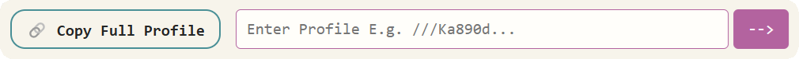
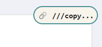
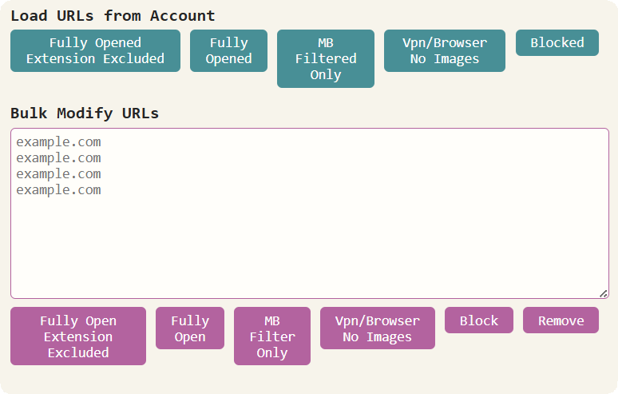
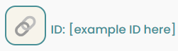
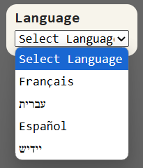
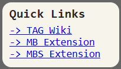
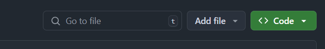
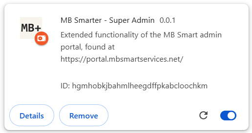

## Welcome to MB Smarter - Super Admin

Version 0.0.1 - Early testing. Expect bugs.

_[---> Skip to installation](#installation)_

This project expands the functionality of the <a href="https://portal.mbsmartservices.net/" target="_blank">MB Smart admin portal</a> by adding new features to improve efficiency. It is designed to integrate seamlessly with the website, but to feel like a superimposed layer that is visually distinct.

**Disclaimer:**
This project is not affiliated with, endorsed by, or maintained by the creators of MB Smart. It is an independent initiative developed by people who use the website. Use this software at your own discretion.

### 1. Filter Profiles

Make changes quickly across various filter settings by copying a profile as a string of text (e.g. `///Ka890d...`) from one account, and pasting it into another. You can also combine strings by placing them end-to-end (e.g. `///Ka890d...///Via9th...`).

### 2. Bulk Modify URLs

Create and manage many URL exceptions at the same time.

### 3. Copy User ID

Easily copy the current user's ID to your clipboard.

### 4. Multilingual Support

An embedded Google Translate menu allows convenient translation between English, Hebrew, Yiddish, French, and Spanish.

### 5. Quick Links

An embedded panel for easy access to often-used links.

## Installation

This software is a browser extension designed for Google Chrome. It is still in early testing, and thus is not available the Chrome Web Store.

To install the test version:

1. Click the **green button** on this project's Github page, and then **Download ZIP**.

2. Once the ZIP file is downloaded to your computer, **extract it** to turn it from ZIP to a regular folder.
3. Open **[chrome://extensions/](chrome://extensions/)** on Google Chrome.
4. Enable **Development mode** on the top right of the page, then click **Load unpacked** from the top row of buttons.

   

5. Select the folder that is **inside** the unzipped folder. E.g. `mb-smarter-main\mb-smarter-main`.
6. You should now see something like this:

   

7. You can now test-run the extension on **[https://portal.mbsmartservices.net/](https://portal.mbsmartservices.net/)**. Enjoy, but expect bugs.

Please send bugs and suggestions to gitmorgen.work@gmail.com.
